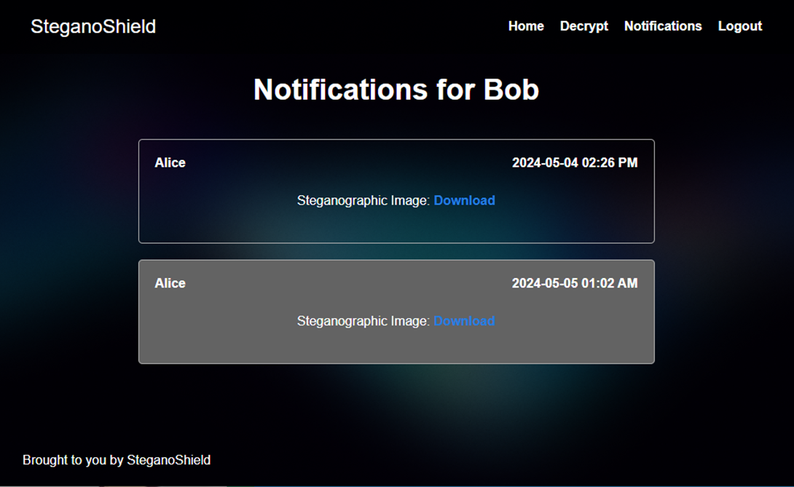

# <p align="center">SteganoShield</p>

### <p align="center">A Cryptography-Steganography project</p>

## Problem Statement
<p align="justify">In modern communication systems, ensuring the confidentiality and integrity of transmitted information is imperative. However, traditional encryption methods often require secure key exchange, which poses logistical challenges. Moreover, even encrypted data can be vulnerable to interception and decryption attempts. This project aims to address these challenges by devising a solution that combines RSA encryption and steganography to provide robust confidentiality and integrity in digital communication without the need for secure key exchange, thereby thwarting interception and decryption attempts.</p>

## Solution
<p align="justify">The proposed solution involves embedding encrypted data within innocuous-looking cover media using steganography techniques. This ensures that even if the communication is intercepted, the hidden data remains concealed. The RSA encryption algorithm is used to encrypt the data before embedding it. This combination of encryption and steganography provides a robust solution for ensuring confidentiality and integrity in digital communication without the need for secure key exchange.</p>

## Project Repo
View Full Project at :- [SteganoShield Repo](https://github.com/tinkerness/steganoshield)

## Tech Stack Used
- Python
- HTML
- CSS
- Flask
- Firebase
- Figma

## Results
SteganoShield successfully provides a robust solution for ensuring confidentiality and integrity in digital communication.

## Demo
### To run the Python code:-
- Navigate to the `steganoshield` directory inside the `steganoshield_copy` directory. You can use the `cd` command to change directories. For example:
    ```bash
    cd path\to\steganoshield_copy\steganoshield
    ```
    Replace `path\to\` with the actual path to the `steganoshield_copy` directory.

- Run the python script:
    ```python
    python steganoshield.py
    ```


### Here's a screenshot of the output:
1. Encryption Process
    

2. Decryption Process
    
3. UI
    
    
    
    
    

## Project Status
- [Completed RSA encryption algorithm](https://github.com/tinkerness/steganoshield/blob/main/proj2_rsa/README.md)

- [Implemented Steganography techniques for data embedding](https://github.com/tinkerness/steganoshield/blob/main/proj3_steganography/README.md)
<!-- 
- [Completed UI design](https://github.com/tinkerness/steganoshield/blob/main/designs/README.md#ui-design) -->

- [Backend integration with Flask framework](https://github.com/tinkerness/steganoshield/blob/main/proj4_html/README.md)

## Team Members
- Anitta Siby
- Rese Raju
